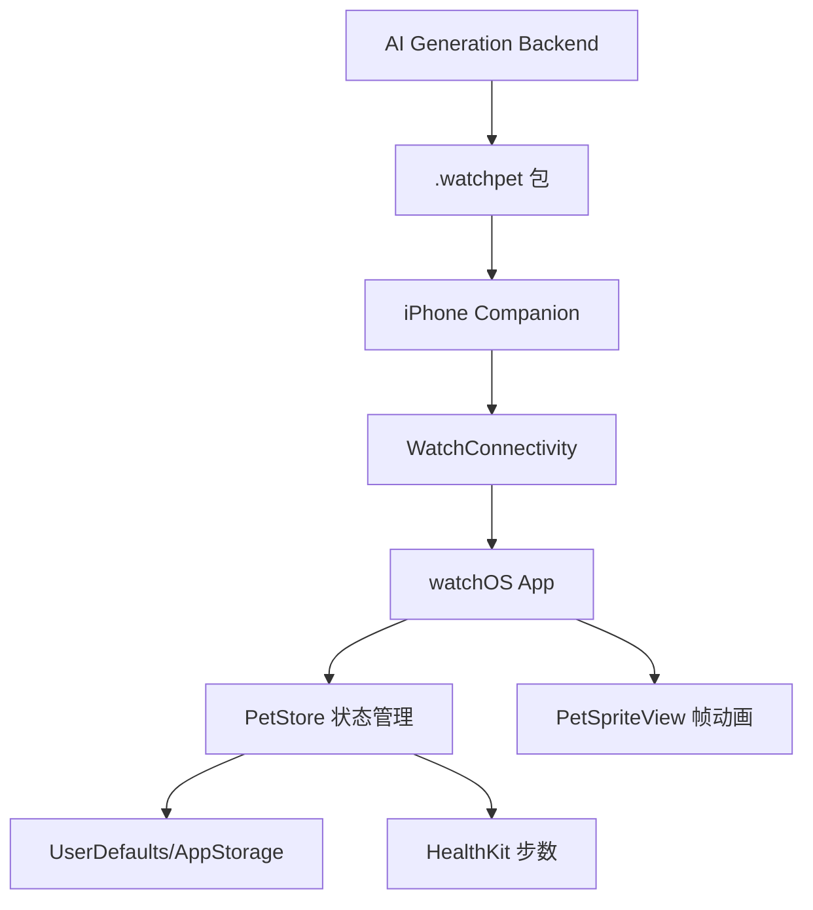

# WatchPet 完整规划总览 v1.0

## 1. 项目一句话

WatchPet 是一个 Apple Watch 上的随身电子宠物：用户可以从宠物照片生成 2D 动画宠物，在手表上摸摸、喂食、陪玩、睡觉、升级，并通过步数/日常活动影响宠物成长。

## 2. 当前决策结论

- 第一阶段不接 Codex 状态，也不做桌面硬件机器人。
- 形态聚焦 Apple Watch 软件宠物。
- 生成体验参考 PetDex：上传照片 -> 生成候选形象 -> 选择最像的一只 -> 生成动作资源包。
- 手表端使用轻量 2D 多帧 PNG 动画，不做 3D。
- MVP 优先本地 Demo：内置宠物 + 互动 + 状态衰减 + 步数经验。
- 第二阶段加入 iPhone 管理端和 `.watchpet` 资源包。
- 第三阶段加入 AI 生成服务。

## 3. 目标用户

1. 养宠物用户：想把真实宠物放到手表上随身陪伴。
2. 喜欢电子宠物/Tamagotchi 的用户：想要轻量养成玩法。
3. Apple Watch 用户：想要有趣、可爱的表盘/手表互动体验。
4. AI 生成玩具用户：愿意上传照片生成专属宠物角色。

## 4. MVP 范围

### 4.1 必做

- Apple Watch 独立 App。
- 宠物动画显示：idle、happy、hungry、eat、sleep、pet、sad、levelUp。
- 触摸互动：点按摸摸。
- 操作按钮：喂食、睡觉。
- 状态系统：饥饿值、心情、精力、经验、等级。
- 时间衰减：长时间不照顾会饿/低心情/低精力。
- 步数经验：HealthKit 读取今日步数，转换经验。
- 本地存储：UserDefaults 或 AppStorage。

### 4.2 暂不做

- 社区/云养广场。
- 宠物交易。
- 多人互动。
- 复杂装扮系统。
- 3D 模型。
- 实时后台动画。
- Codex 状态同步。

## 5. 功能路线图

### Phase 0：概念与技术验证，已完成初版产物

交付：

- `WatchPetDemoSkeleton`：Swift 代码骨架。
- `WatchPetXcodeProject`：可打开的 Xcode 项目结构。
- 占位宠物帧素材。

### Phase 1：Apple Watch 本地 MVP

目标：不用 AI、不用 iPhone，也能玩起来。

验收：

- 能在 Apple Watch Simulator 或真机启动。
- 宠物能播放待机动画。
- 点按宠物触发 pet 动作并提升心情。
- 喂食按钮触发 eat 动作并提升饥饿值。
- 睡觉按钮触发 sleep 动作并恢复精力。
- 关闭后重开，宠物状态仍保存。
- 健康权限允许后，步数能增加经验。

### Phase 2：iPhone Companion

目标：iPhone 端管理宠物、预览资源、同步给 Watch。

功能：

- 宠物列表。
- 宠物详情。
- 宠物包导入。
- 资源预览。
- WatchConnectivity 同步。

### Phase 3：`.watchpet` 资源包

目标：让宠物形象可替换。

功能：

- zip 包解析。
- `manifest.json` 校验。
- 多动作 PNG 动画加载。
- iPhone 预览。
- 同步资源到 Apple Watch。

### Phase 4：AI 生成服务

目标：参考 PetDex，通过照片生成宠物动作包。

流程：

1. 上传宠物照片。
2. 生成 6 个候选形象。
3. 用户选择最像的一只。
4. 锁定角色设定。
5. 生成动作帧。
6. 透明背景处理。
7. 一致性检查。
8. 打包 `.watchpet`。

### Phase 5：商业化/增强玩法

可选方向：

- 多宠物。
- 装扮/道具。
- 表盘 complication。
- 每日任务。
- 云端备份。
- 作品广场。
- 订阅式高级生成。

## 6. 核心玩法系统

### 6.1 宠物属性

| 属性 | 范围 | 含义 |
|---|---:|---|
| hunger | 0-100 | 越高越饱 |
| mood | 0-100 | 越高越开心 |
| energy | 0-100 | 越高越有精神 |
| exp | >=0 | 当前等级经验 |
| level | >=1 | 宠物等级 |
| lastUpdatedAt | Date | 用于离线衰减 |
| lastCareAt | Date | 用于提醒/亲密度 |

### 6.2 状态判定

| 条件 | 动作/状态 |
|---|---|
| energy < 20 | sleep |
| hunger < 30 | hungry |
| mood < 30 | sad |
| mood > 85 | happy |
| 点击宠物 | pet |
| 点击喂食 | eat |
| 经验升级 | levelUp |
| 默认 | idle |

### 6.3 时间衰减建议

- 每 30 分钟 hunger -1。
- 每 45 分钟 mood -1。
- 每 60 分钟 energy -1。
- 打开 App 时计算离线衰减，不依赖长后台运行。

## 7. 技术架构



## 8. 技术选型

| 模块 | MVP | 后续 |
|---|---|---|
| Watch UI | SwiftUI | SwiftUI + SpriteKit |
| 动画 | 多帧 PNG | 动态资源包加载 |
| 状态管理 | ObservableObject | SwiftData/App Group |
| 本地存储 | UserDefaults | SwiftData |
| 步数 | HealthKit | Activity rings/更多健康数据 |
| iPhone-Watch 同步 | 暂无 | WatchConnectivity |
| 表盘 | 暂无 | WidgetKit complication |
| 生成服务 | 暂无 | OpenAI Images/其他图像模型 |
| 资源包 | 示例 manifest | zip + JSON + PNG |

## 9. `.watchpet` 包标准

最小结构：

```text
mochi.watchpet
├── manifest.json
├── preview.png
├── icon.png
└── sprites/
    ├── idle/000.png
    ├── happy/000.png
    ├── hungry/000.png
    ├── eat/000.png
    ├── sleep/000.png
    ├── pet/000.png
    ├── sad/000.png
    └── levelUp/000.png
```

详见 `02_WATCHPET_PACKAGE_SPEC.md`。

## 10. 主要风险与规避

| 风险 | 影响 | 规避 |
|---|---|---|
| Apple Watch 后台限制 | 无法长期后台动画 | 只在打开 App 时动画，后台用通知/complication |
| HealthKit 审核/授权 | 步数无法读取 | 步数作为可选增强，不阻断主玩法 |
| AI 动作一致性差 | 宠物不像原宠物 | 先生成主形象并锁定 reference，再生成动作 |
| watchOS 存储/性能限制 | 动画资源过大 | 控制 PNG 尺寸 128-184px，每动作 4-8 帧 |
| Xcode 项目需 Mac 验证 | 当前 Windows 环境无法编译 | 在 README 标明需要 Xcode 设置 Team/Bundle ID |

## 11. 当前已交付文件

- `outputs/WatchPetDemoSkeleton`：Demo 骨架。
- `outputs/WatchPetXcodeProject`：完整 Xcode 项目结构。
- `outputs/WatchPetXcodeProject.zip`：Xcode 项目压缩包。
- `outputs/WatchPetPlanning`：完整规划文档包。

## 12. 下一步建议

最推荐下一步：在 macOS/Xcode 上打开 `WatchPetXcodeProject`，先跑通 watchOS Simulator。若能运行，再进行：

1. 替换正式宠物素材。
2. 加 iPhone Companion target。
3. 加 Widget complication target。
4. 实现 `.watchpet` 解析器。
5. 接入 AI 生成服务。
