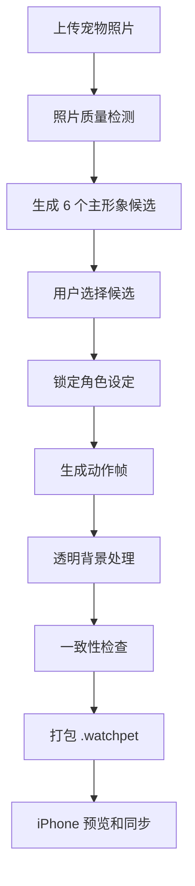

# AI 宠物生成规划 v1.0

## 参考体验

参考 PetDex 的产品流程：上传宠物照片，生成多个主形象候选，用户选择最像的一只，然后生成待机、走路、睡觉等动作资源包。WatchPet 采用同样的体验逻辑，但输出为 Apple Watch 友好的轻量 2D PNG 动画包。

## 生成总流程



## 生成风格

MVP 建议只支持两种：

1. 像素风：低分辨率、轮廓清晰、适合 Apple Watch。
2. Q 版贴纸风：圆润、可爱、清晰色块。

暂不建议：写实风、3D、复杂背景、长视频。

## 主形象生成要求

输入：用户上传 1-3 张宠物照片。

输出：6 张候选：

- 正面或 3/4 视角。
- 透明背景或纯色背景。
- 宠物特征明显：毛色、耳朵、尾巴、花纹。
- 适合缩放到 Apple Watch 小屏。

## 动作生成要求

基础动作：

| 动作 | 帧数 | 说明 |
|---|---:|---|
| idle | 4 | 待机眨眼/轻微起伏 |
| happy | 6 | 开心跳/摇尾巴 |
| hungry | 4 | 饿了/看食物 |
| eat | 6 | 吃东西 |
| sleep | 4 | 睡觉/呼吸 |
| pet | 6 | 被摸摸/蹭手 |
| sad | 4 | 难过/垂耳 |
| levelUp | 8 | 升级闪光 |

## 提示词模板

### 主形象候选

```text
Create a cute Apple Watch virtual pet character based on the uploaded pet photo.
Style: pixel-cute / sticker-like, simple silhouette, clear colors, transparent background.
Preserve key features: fur color, markings, ear shape, tail shape, face pattern.
Canvas: square, centered, no text, no accessories unless visible in the pet photo.
The character must remain readable at 128x128 pixels.
Generate 6 distinct but consistent candidate designs.
```

### 动作帧

```text
Generate a {action} animation sprite sheet for the selected virtual pet character.
Keep the exact same character identity, colors, markings, proportions, face, ears and tail.
Style: pixel-cute / sticker-like, transparent background.
Frame count: {frame_count}.
Canvas: square, centered, consistent scale.
No text. No background. No camera movement.
Action description: {action_description}.
```

## 质量检查

必须检查：

- 背景透明。
- 动作之间角色一致。
- 耳朵、毛色、花纹不漂移。
- 每帧居中，尺寸一致。
- 小屏缩放后可读。
- 循环动画首尾自然。
- PNG 体积适合 Watch 同步。

## 失败兜底

- 若候选不像原宠物：允许用户重新生成候选。
- 若某动作失败：只重试该动作。
- 若透明背景处理失败：用分割模型或手动 alpha 清理。
- 若体积过大：压缩 PNG 或降低帧数。
